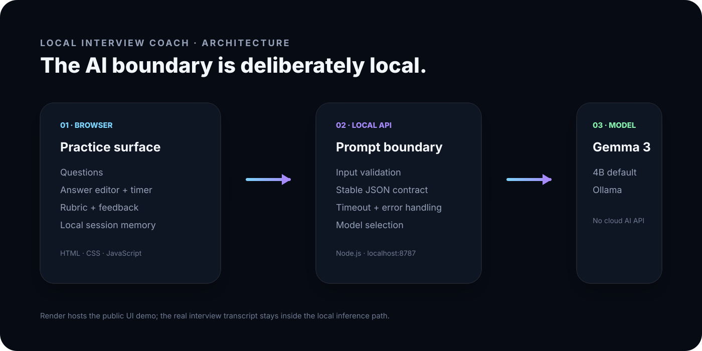
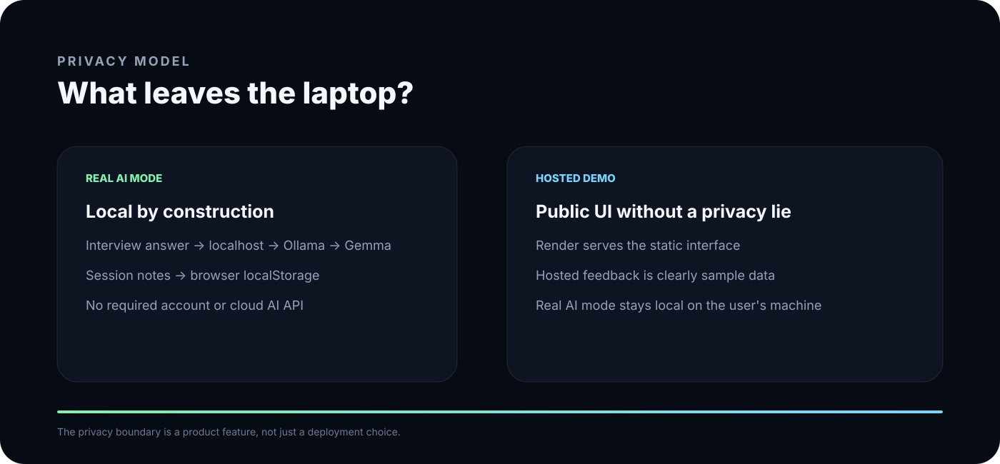

# Local Interview Coach

A local-first interview practice partner built for a friend preparing for software interviews.

> Hacktoberfest 2026 — Weekend Challenge: Build for a Friend

## The problem

Mock interviews are useful, but they are difficult to repeat when every session needs another person to act as the interviewer. The coach turns that friction into a small daily loop:

**question → answer → critique → follow-up → repeat**

The project is intentionally narrow. It is not a generic chatbot and it does not try to replace an interviewer. It is a rehearsal tool.

## What makes it different

- **Open-weight AI at the core:** Gemma 3 runs through Ollama for the real application.
- **Private by design:** interview answers stay on the user's machine in real AI mode.
- **Useful feedback:** the model returns a score, strengths, improvements, a five-part signal rubric, and a follow-up question.
- **Pressure mode:** a 60-second timer makes the practice closer to a real interview.
- **Session memory:** recent attempts are saved locally in the browser.
- **Honest hosted demo:** Render hosts the UI, while the public demo uses clearly labeled sample feedback instead of pretending a private local model is running in the cloud.

## Demo

**Live:** https://friend-interview-coach-hf26.onrender.com

The public demo lets judges experience the entire interaction without an account. It is clearly labeled as sample-feedback mode.

For the real AI path:

NaN

NaN

## Architecture

NaN

Render only hosts the static demonstration surface. The application's AI boundary stays local.

## Local setup

### 1. Install Ollama and pull the model

NaN

### 2. Start the review API

NaN

### 3. Start the web UI

NaN

NaN

### 4. Open the app

NaN

### Swap the model

NaN

NaN

Any compatible local Ollama chat model can be used as long as it can return JSON.

## Engineering details

The prompt contract asks the model for structured JSON:

NaN

This gives the UI stable data instead of rendering free-form model text.

The repository also includes executable contract tests and GitHub Actions checks for:

NaN

NaN

## Why open innovation matters

For interview practice, privacy is part of the product requirement.

A candidate may paste project details, failed interview answers, or notes about previous interviews. With local Gemma inference, those answers do not need to be uploaded to a closed AI provider just to receive feedback.

Open-weight models also keep the coach replaceable: Gemma is the default, but the user can switch local models without rewriting the product.

## License

MIT